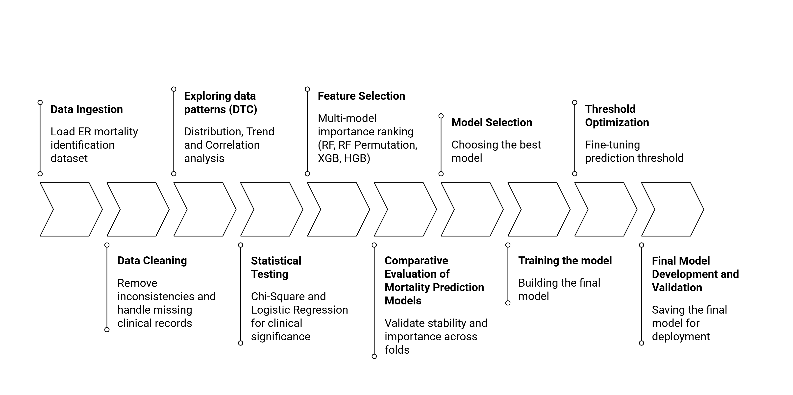

# ER Mortality Prediction Using Machine Learning



## Project Overview

Early identification of high-risk patients in the Emergency Department (ED) is critical for timely interventions and resource allocation. This project uses machine learning to predict mortality risk in ED patients based on routinely collected clinical and laboratory features. The final model is a Random Forest classifier that takes the top five rigorously selected features and predicts whether a patient is closer to **mortality** or **survival**.

## Objectives

- Develop and validate predictive models for estimating mortality in critically ill ED patients.  
- Compare machine learning models with traditional statistical models.  
- Identify key predictors using feature importance analyses.  
- Evaluate feasibility of real-time integration in ED workflows.  
- Utilize Natural Language Processing (NLP) for insights from unstructured clinical data.  
- Augment the dataset with synthetic data to improve model robustness.

## Methodology

The study workflow is summarized below:


**Key steps:**

1. **Data Loading & Cleaning:**  
   Demographic, clinical, laboratory, and outcome data were loaded. Missing values and inconsistent entries were corrected without aggressive row deletion to preserve records.

2. **Exploratory Data Analysis (EDA):**  
   - Distribution, trend, and correlation analyses were performed.  
   - Identified clinically meaningful variables, multicollinearity, and data quality issues.

3. **Statistical Analysis:**  
   - Chi-square tests and logistic regression established baseline relationships between predictors and mortality.  
   - Provided interpretability for comparison with machine learning models.

4. **Feature Selection:**  
   - Multi-model approach: Random Forest, XGBoost, HistGradientBoosting.  
   - Top features assessed for clinical relevance, stability, and redundancy.  
   - **Top five features selected:** Lactate (ABG), Creatinine, Platelets, Urea, Resuscitation Received.

5. **Model Development & Comparison:**  
   - Logistic Regression, HistGradientBoosting, and Random Forest evaluated using K-fold cross-validation.  
   - Random Forest achieved superior performance, handling missing data, non-linearity, and interpretability.

6. **Final Model Training & Threshold Optimization:**  
   - Trained on top five features.  
   - Probability threshold optimized at 0.612 for balanced sensitivity and specificity.

7. **Model Persistence:**  
   - Final Random Forest model serialized as `rf_mortality_model.pkl` for Streamlit deployment.

## Results & Findings

- **Feature Importance:**  
  - Lactate (ABG), Creatinine, Platelets, Urea, Resuscitation Received were most predictive.  

- **Statistical Insights:**  
  - Low GCS, high Shock Index, elevated NEWS2 associated with mortality.  
  - Age and gender did not significantly modify predictions.

- **Model Performance:**  
  - Random Forest: F1-score 0.784, Precision 0.767, Recall 0.802, ROC-AUC 0.707 ± 0.054.  
  - Outperformed logistic regression and gradient boosting models.  

- **Clinical Relevance:**  
  - Early identification of high-risk patients.  
  - Threshold selection balances recall and false alarms.  
  - Outperformed NEWS2 scoring in discriminative ability.

- **Limitations:**  
  - Single-center dataset.  
  - External validation needed.  
  - Future work: integrate real-time monitoring and explainable AI.

## Conclusion

The Random Forest-based five-feature model provides a robust, interpretable tool for ED mortality risk stratification. It balances clinical usability, predictive performance, and interpretability, offering actionable insights to support emergency care decision-making.

## How to Run the Streamlit App

1. Clone the repository:
```bash
git clone https://github.com/<your-username>/ER-Mortality-Prediction.git
